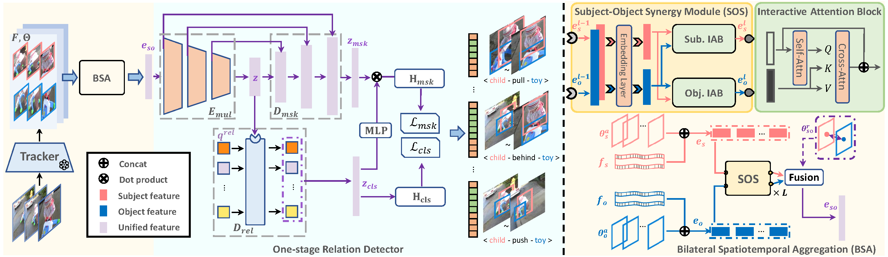

# VrdONE: One-stage Video Visual Relation Detection
Pytorch Implementation of ACM MM 2024 paper **"VrdONE: One-stage Video Visual Relation Detection"**.

[[`arXiv`]](https://arxiv.org/abs/2408.09408) [[`ACM MM`]](https://dl.acm.org/doi/10.1145/3664647.3680833)

<div align="center">
  
</div><br/>


## Abstract

Video Visual Relation Detection (VidVRD) focuses on understanding how entities interact over time and space in videos, a key step for gaining deeper insights into video scenes beyond basic visual tasks. Traditional methods for VidVRD, challenged by its complexity, typically split the task into two parts: one for identifying what relation categories are present and another for determining their temporal boundaries. This split overlooks the inherent connection between these elements. Addressing the need to recognize entity pairs' spatiotemporal interactions across a range of durations, we propose VrdONE, a streamlined yet efficacious one-stage model. VrdONE combines the features of subjects and objects, turning predicate detection into 1D instance segmentation on their combined representations. This setup allows for both relation category identification and binary mask generation in one go, eliminating the need for extra steps like proposal generation or post-processing. VrdONE facilitates the interaction of features across various frames, adeptly capturing both short-lived and enduring relations. Additionally, we introduce the Subject-Object Synergy (SOS) module, enhancing how subjects and objects perceive each other before combining. VrdONE achieves state-of-the-art performances on the VidOR benchmark and ImageNet-VidVRD, showcasing its superior capability in discerning relations across different temporal scales.

## Installation

1. This repository needs `python=3.10.14`, `pytorch=1.12.1`, and `torchvision=0.13.1`
2. Run the following command to install the required packages.
   ```
   pip install -r requirements.txt
   ```
3. Clone Shang's evaluation helper https://github.com/xdshang/VidVRD-helper to the root path and rename the folder as `VidVRD_helper`.


## Data Preparation

Install `ffmpeg` using `sudo apt-get install ffmpeg`. The organization of datasets should be like this:

```

├── datasets
│   ├── coco
│   ├── mega
│   ├── vidor
│   │   ├── annotations
|   |   |   ├── training
|   |   |   |   ├── 0000
|   |   |   |   ├── ...
|   |   |   |   └── 1203
|   |   |   └── validation
|   |   |       ├── 0001
|   |   |       ├── ...
|   |   |       └── 1203
|   |   ├── cache
|   |   |   ├── MEGA_mask_clip_VidOR_training
|   |   |   ├── MEGA_mask_clip_VidOR_validation
|   |   |   ├── MEGA_mask_VidOR_training
|   |   |   └── MEGA_mask_VidOR_validation
|   |   ├── features
|   |   |   ├── clip_features_training
|   |   |   ├── clip_val_proposal
|   |   |   ├── GT_boxfeatures_training
|   |   |   ├── MEGA_VidORval_cache
|   |   |   |   └─ MEGAv9_m60s0.3_freq1_VidORval_freq1_th_15-180-200-0.40.pkl
|   |   |   └── vidor_per_video_val
|   |   ├── frames
│   │   └── videos
|   |       ├── 0000
|   |       ├── ...
|   |       └── 1203
|   ├── VidSGG-BIG 
│   ├── vidvrd
│   │   ├── annotations
|   |   |   ├── test
|   |   |   └── train
|   |   ├── cache
|   |   |   ├── MEGA_mask_VidOR_test
|   |   |   └── MEGA_mask_VidOR_train
|   |   ├── features
|   |   |   ├── GT_boxfeatures_training
|   |   |   ├── Proposal_boxfeatures_test
|   |   |   ├── vidvrd_per_video_val
|   |   |   └── VidVRD_test_every1frames
|   |   ├── frames
│   │   └── videos
|   |       ├── ILSVRC2015_train_00005003.mp4
|   |       ├── ...
|   ├── vidor_policy.txt
|   ├── vidor_video_to_frames.py
|   └── vidvrd_video_to_frames.py
├── experiments
├── models
...
├── VidVRD_helper
...
```


### VidOR

1. Download the [VidOR](https://xdshang.github.io/docs/vidor.html) dataset. Unzip all videos (training and validation) into `datasets/vidor/videos`. Unzip the training and validation annotations into `datasets/vidor/annotations`.
2. Go to the `datasets` directory and run the following command to decode the videos into frames.
   ```
   python vidor_video_to_frames.py
   ```
3. Extract visual features from gt bounding boxes. We follow Gao's method from https://github.com/Dawn-LX/VidVRD-tracklets. First, download [the pretrained weight of MEGA](https://drive.google.com/file/d/1nypbyRLpiQkxr7jvnnM4LEx2ZJuzrjws/view) and put it into `datasets/mega/ckpts`. Step into `datasets/mega` and run the following command to extract features.
   ```
   bash scripts/extract_vidor_gt.sh [gpu_id]
   ```
   Or we can download our extracted features from [Hugging Face](https://huggingface.co/datasets/guacamole99/vrdone_features) and unzip it into the corresponding place.
4. Download the [extracted proposal features of validation set](https://mega.nz/folder/VcwA1DaI#YW2M_uFsbsE6twHDIpfPuw) from [Gao's method (BIG)](https://github.com/Dawn-LX/VidSGG-BIG). Then, put it into `datasets/vidor/features/MEGA_VidORval_cache`. We copy the `dataloader` part from [BIG](https://github.com/Dawn-LX/VidSGG-BIG). Step into `datasets/VidSGG-BIG` and divide the proposal features into per-video ones by the following command:
   ```
   python prepare_vidor_proposal.py
   ```
5. For the vrdone-x, we need to extract the clip features. First, install [CLIP](https://github.com/openai/CLIP). Second, extract the features for training and evaluation respectively. We step into `datasets/mega`, run
   ```
   CUDA_VISIBLE_DEVICES=[gpu_id] python -W ignore extract_gt_clip_features_vidor.py
   ```
   and
   ```
   CUDA_VISIBLE_DEVICES=[gpu_id] python -W ignore extract_val_clip_features_vidor.py
   ```
   Or we can download our extracted features from [Hugging Face](https://huggingface.co/datasets/guacamole99/vrdone_features) and unzip them into the corresponding places.

### VidVRD

1. Download the [ImageNet-VidVRD](https://xdshang.github.io/docs/imagenet-vidvrd.html) dataset. Unzip all videos into `datasets/vidvrd/videos`. Unzip the annotations into `datasets/vidvrd/annotations`.
2. Go to the `datasets` directory and run the following command to decode the videos into frames.
   ```
   python vidvrd_video_to_frames.py
   ```
3. Extract visual features from gt bounding boxes. We follow Gao's method from https://github.com/Dawn-LX/VidVRD-tracklets. Because Gao did not provide the trained checkpoints, we trained the model ourselves. Download [COCO 2014](https://cocodataset.org/) and put the dataset into `datasets/coco`. Step into `datasets/mega` and run the command to extract coco annotations.
   ```
   python extract_coco.py
   ```
   Then train the detector.
   ```
   bash scripts/train_mega_vidvrd.sh 2 [gpu_ids]
   ```
   Then we finetune the detector using the ImageNet-VidVRD dataset.
   ```
   bash scripts/finetune_mega_vidvrd.sh 2 [gpu_ids]
   ```
   Or we can download our pretrained checkpoint from [Hugging Face](https://huggingface.co/guacamole99/vrdone). Keep in mind that the model weight `model_0190000.pth` should be put into `datasets/mega/experiments/vidvrd/COCO21VRDfreq5_2gpu_finetune_lr1`.
   Then, extract the gt features of the training set with the following command:
   ```
   bash scripts/extract_vidvrd_gt.sh [gpu_id]
   ```
   Or we can download our extracted features from [Hugging Face](https://huggingface.co/datasets/guacamole99/vrdone_features) and unzip it into the corresponding place.
4. Download the [extracted proposal features of test set](https://mega.nz/file/wJhiwbbB#AR-YuKrS_uNEfypk9T1g-mb4GZFe7wEwIrmd7xtnRos) from [Gao's method (BIG)](https://github.com/Dawn-LX/VidSGG-BIG). Then, put it into `datasets/vidvrd/features/VidVRD_test_every1frames`. Step into `datasets/VidSGG-BIG` and process the feature with:
   ```
   python prepare_vidvrd_proposal.py
   ```
5. For the proposal features, we further need to process them. Step into `datasets/mega` and run:
   ```
   python -W ignore extract_test_features_vidvrd.py --gpu_id ${gpu_id}
   ```
   Or we can download our extracted features from [Hugging Face](https://huggingface.co/datasets/guacamole99/vrdone_features) and unzip it into the corresponding place.


## Train 
1. **VrdONE for vidor**. By default, we train the model with a single gpu.
   ```
   bash scripts/train_vidor.sh 1 [gpu_id]
   ```
   Change the `batch_size` in the config and train the model with multiple gpus.
   ```
   bash scripts/train_vidor.sh [num_gpus] [gpu_ids]
   ```
2. **VrdONE-X for vidor**. By default, we train the model with a single gpu.
   ```
   bash scripts/train_vidor_x.sh 1 [gpu_id]
   ```
   Change the `batch_size` in the config and train the model with multiple gpus.
   ```
   bash scripts/train_vidor_x.sh [num_gpus] [gpu_ids]
   ```
3. **VrdONE for vidvrd**. 
   ```
   bash scripts/train_vidvrd.sh 1 [gpu_id]
   ```

## Eval
1. **VrdONE for vidor**. Download our vrdone checkpoint and evaluate with the following command.
   ```
   bash scripts/eval_vidor_ckpt.sh [gpu_id]
   ```
   If we already have trained our own model, we can evaluate all trained checkpoints.
   ```
   bash scripts/eval_vidor_multi.sh [gpu_id]
   ```
   We can change the `topk` and the `ckpt_path` to check.

2. **VrdONE-X for vidor**. Download our vrdone-x checkpoint and evaluate with the following command.
   ```
   bash scripts/eval_vidor_x_ckpt.sh [gpu_id]
   ```
   If we already have trained our own model, we can evaluate all trained checkpoints.
   ```
   bash scripts/eval_vidor_x_multi.sh [gpu_id]
   ```
   We can change the `topk` and the `ckpt_path` to check.
3. **VrdONE for vidvrd**. Download our vrdone checkpoint for vidvrd and Run:
   ```
   bash scripts/eval_vidvrd_ckpt.sh [gpu_id]
   ```
   Or
   ```
   bash scripts/eval_vidvrd_multi.sh [gpu_id]
   ```
   When using our provided model, don't forget to replace the config of `dataset_config.test_boxfeatures_dir` to the path of our provided data.

## Model Zoo
Hugging Face model repository: https://huggingface.co/guacamole99/vrdone.

Hugging Face dataset repository: https://huggingface.co/datasets/guacamole99/vrdone_features.

| Model | Dataset | Extra Features | Download Path |
|-------|---------------|-------| ---------------|
|VrdONE | VidOR | - | [Hugging Face](https://huggingface.co/guacamole99/vrdone)|
|VrdONE-X | VidOR | CLIP | [Hugging Face](https://huggingface.co/guacamole99/vrdone) |
|VrdONE | ImageNet-VidVRD | - | [Hugging Face](https://huggingface.co/guacamole99/vrdone) |

## Citation
```
@inproceedings{jiang2024vrdone,
  author = {Jiang, Xinjie and Zheng, Chenxi and Xu, Xuemiao and Liu, Bangzhen and Zheng, Weiying and Zhang, Huaidong and He, Shengfeng},
  title = {VrdONE: One-stage Video Visual Relation Detection},
  booktitle = {Proceedings of the 32nd ACM International Conference on Multimedia},
  year = {2024},
}
```

## Acknowledgement

This project is mainly based on [ActionFormer](https://github.com/happyharrycn/actionformer_release), [MaskFormer](https://github.com/facebookresearch/MaskFormer), and [BIG](https://github.com/Dawn-LX/VidSGG-BIG). Thanks for their amazing projects!
